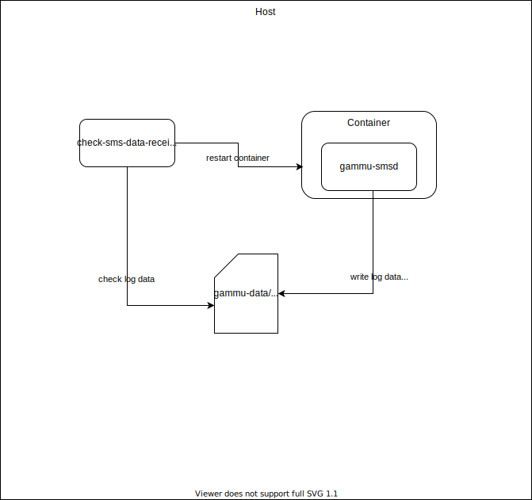

# gammu-smsd configuration

gammu-smsd will receive sms and forward the content of sms via telegram

## Hardware:
supported hardware Huawei E173


## Run with docker

### .env

```bash
TOKEN=<your-telegram-bot-token>
CHAT_ID=<your-chat-token>
```

### Simple running

```bash
docker run -it -d --env-file .env \
--device=/dev/ttyUSB0 \
--name gammu-smsd gammu-smsd:latest
```

### Running with binding log data
The following command will run docker and bind:

- gammu-data:
    - inbox
    - outbox
    - archieve
    - error

    folders for storing sms

- gammu-smsd.log
- receive-sms.log

```bash
docker run -it -d --env-file .env \
--device=/dev/ttyUSB0 \
--mount type=bind,source=$DIR/gammu-data,target=/var/spool/gammu \
--mount type=bind,source=$DIR/gammu-smsd.log,target=/var/log/gammu-smsd.log \
--mount type=bind,source=$DIR/receive-sms.log,target=/var/log/receive-sms.log \
--name gammu-smsd gammu-smsd:latest
```
## inspect restarts
docker inspect -f "{{ .RestartCount }}"

## check if gammu-smsd in docker have Problem

### normal state
there will be always this message logged in normal state (a few times in one minute)
```
Thu 2021/01/28 10:23:58 gammu-smsd[8]: gammu: SMS status received
```
### something went wrong
this is the typical logging information if something went wrong, no more ```SMS status received```.
```
Wed 2021/01/27 22:24:38 gammu-smsd[8]: gammu: Checking line: ^STIN:1,1,0
Wed 2021/01/27 22:24:38 gammu-smsd[8]: gammu: AT reply state: 4
Wed 2021/01/27 22:24:38 gammu-smsd[8]: gammu: RECEIVED frame type 0x00/length 0x0D/13
Wed 2021/01/27 22:24:38 gammu-smsd[8]: gammu: 5E^|53S|54T|49I|4EN|3A:|311|2C,|311|2C,|300|0D |0A              ^STIN:1,1,0..   
Wed 2021/01/27 22:24:43 gammu-smsd[8]: gammu: 1 "^STIN:1,1,0"
```

### Solution
1. check the logfile to get last 200 lines
2. count how many ```SMS status received``` inside
3. if not found (count is 0): restart container
4. check 1-3 every minutes


## [How to from scrath](How_to.md)

[telegram api](https://core.telegram.org/bots/api)

## Structure
